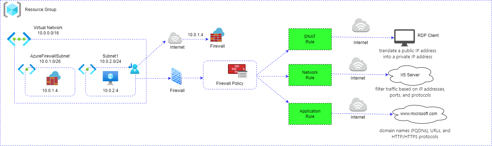

# Azure_Firewall

## Architecture Diagram :

### Further Steps involved are (Azure Portal) :

- First we have to create the Resource Group (fw-rg).
- Next,we create the Virtual Network with subnets (AzureFirewallSubnet , Subnet1).
- Deploy the Virtual Machine in Subnet1 and deploy Firewall with Firewall-policy in AzureFirewallSubnet.
- Create the route table for block the Internet via Firewall.
- Route in Route table ,
  - 1.Route name : Block Internet
  - 2.Destination type : IP address
  - 3.Destination IP address : 0.0.0.0/0 (Any)
  - 4.Next hop type : Virtual Appliances
  - 5.Next hop address : Firewall private IP

- Associate the Route table for Subnet1.
- Firewall policy contains 3 Rule sets ,
  - 1.DNAT Rule
  - 2.Network Rule
  - 3.Application Rule

##### DNAT Rule :
- It translate a public IP address into a private IP address.
- Take the RDP to VM in Subnet1 through Firewall public IP.
- Rule in DNAT Rule ,
  - 1.Name : Allow-rdp
  - 2.Source type : IP address
  - 3.Source : * (All)
  - 4.Protocol : TCP
  - 5.Destination ports : 3389
  - 6.Destination : Firewall public IP
  - 7.Translated type : IP address
  - 8.Translated address : VM private IP

##### Network Rule :
- It filter traffic based on IP addresses, ports, and protocols.
- Install IIS Server in VM and Browse the public IP in outside , got IIS home page but didn't get the IIS page in VM because block all traffic denied by firewall.
- Rule in Network Rule ,
  - 1.Name : Allow-Web-Server
  - 2.Source type : IP address
  - 3.Source : VM private IP
  - 4.Protocol : TCP
  - 5.Destination ports : 80
  - 6.Destination type : IP address
  - 7.Destination : IIS server Public IP

##### Application Rule :
- It filter traffic based on fully qualified domain names (FQDNs), URLs, and HTTP/HTTPS protocols.
- Allow the www.microsoft.com in VM through Firewall.
- Rule in Application Rule ,
  - 1.Name : Allow-MS-FDQN
  - 2.Source type : IP address
  - 3.Source : VM private IP
  - 4.Protocol : https
  - 5.Destination type : FQDN
  - 6.Destination : www.microsoft.com